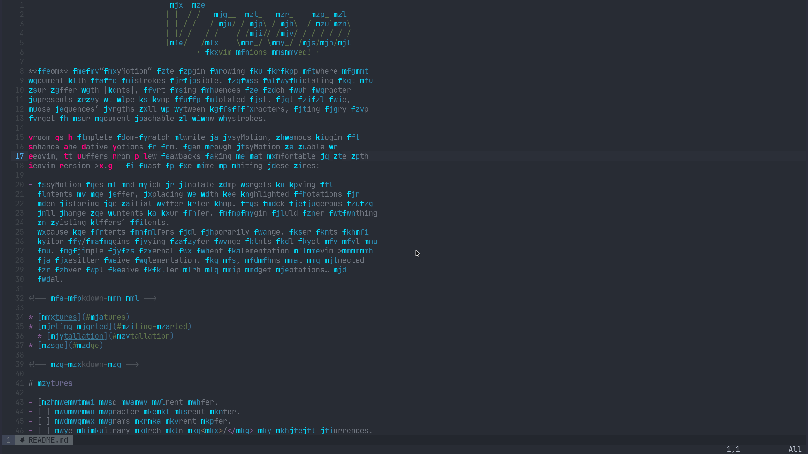

                                _    __
                               | |  / /   _____  ____   ____    ____ ___
                               | | / /   / ___/ / __ \ / __ \  / __ `__ \
                               | |/ /   / /    / /_/ // /_/ / / / / / / /
                               |___/   /_/     \____/ \____/ /_/ /_/ /_/
                                      · Neovim motions on speed! ·

**Vroom** is an “EasyMotion” like plugin allowing you to jump anywhere in a
document with as few keystrokes as possible. It does so by annotating text in
your buffer with |hints|, short string sequences for which each character
represents a key to type to jump to the annotated text. Most of the time,
those sequences’ lengths will be between 1 to 3 characters, making every jump
target in your document reachable in a few keystrokes.

Vroom is a complete from-scratch rewrite of EasyMotion, a famous plugin to
enhance the native motions of Vim. Even though EasyMotion is usable in
Neovim, it suffers from a few drawbacks making it not comfortable to use with
Neovim version >0.5 – at least at the time of writing these lines:

- EasyMotion uses an old trick to annotate jump targets by saving the
  contents of the buffer, replacing it with the highlighted annotations and
  then restoring the initial buffer after jump. This trick is dangerous as it
  will change the contents of your buffer. A UI plugin should never do anything
  to existing buffers’ contents.
- Because the contents of buffers will temporarily change, other parts of the
  editor and/or plugins relying on buffer change events will react and will go
  mad. An example is the internal LSP client implementation of Neovim >0.5 or
  its treesitter native implementation. For LSP, it means that the connected
  LSP server will receive a buffer with the jump target annotations… not
  ideal.

<!-- vim-markdown-toc GFM -->

* [Features](#features)
* [Getting started](#getting-started)
  * [Disclaimer and experimental notice](#disclaimer-and-experimental-notice)
  * [Installation](#installation)
* [Usage](#usage)

<!-- vim-markdown-toc -->

# Features

- [x] Go to any word in the current buffer.
- [ ] Go to any character in the current buffer.
- [ ] Go to any bigrams in the current buffer.
- [ ] Make an arbitrary search akin to <kbd>/</kbd> and go to any occurrences.



# Getting started

This section will guide you through the list of steps you must take to be able to get started with **Vroom**.

> This plugin was written against Neovim 0.5, which is currently a nightly version. However, Neovim 0.4 should work
> too. If you are still on Neovim 0.4, feel free to reach out and tell me how is your experience going.

## Disclaimer and experimental notice

**Please read this section before going on any further.**

The plugin was born from scratch on 5th Febrary of 2021 and, at the time of writing this, is two days old. Even though
it has reached a usable state, it still has some remaining issues to fix. You can get the full list of them with the
embedded help, if you are curious:

```vim
:help vroom-limitations-issues
```

If you are encountering any of these issues, **you do not have to open an issue as it is already being actively worked
on.** However, PRs are be greatly appreciated.

## Installation

Using [vim-plug](https://github.com/junegunn/vim-plug):

```vim
Plug 'phaazon/vroom'
```

# Usage

A simple vim command is available to test with the default options: `:VroomWord`. If you would rather use the Lua API,
you can test it via the command prompt:

```vim
:lua require'vroom'.jump_words()
```

If you want to create a key binding (<kbd>$</kbd> in this example) from within Lua:

```lua
-- place this in one of your configuration file(s)
vim.api.nvim_set_keymap('n', '$', "<cmd>lua require'vroom'.jump_words()<cr>", silent_noremap_opt)
```

For a more complete user guide and help pages:

```vim
:help vroom
```

More functions and commands to come soon.
